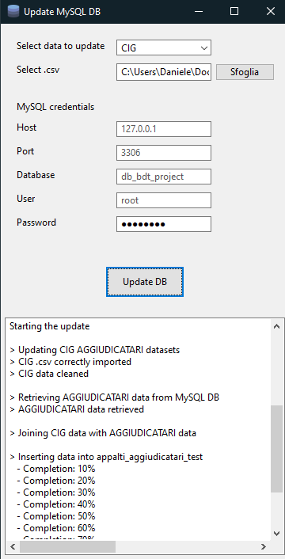
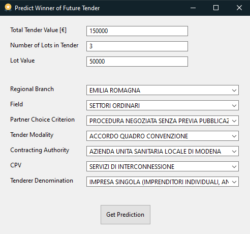

# BDT_Project_2021

Project of BDT - Giorgia Villa, Daniele Passabì

### *Description*

This code provides a possible implementation of a Big Data System able to preform predictions on tenders published by the Italian administrative bodies. It returns the most likely winners of a tender specified by the end-user through a customised interface. Predictions are based on historical data and obtained through a machine learning model running a K-NearestNeighbour classification algorithm.

## Set ups

### *How to start (end user)*

The end-user is required to run the NOME_DELL_EXE file exe. This will open a window were some company and tender information need to be specified. After this, it is enough to click on the *Get prediction* button and the prediction for the most likely tender winner will be displayed.

### *How to start (developer)*

We suppose that the first step of the solution (the population of the MySQL database) has already been implemented. Therefore from the developer side, the only action to be performed is the update of the above-mentioned database. Recalling that tender information and winners information have to be updated monthly and every six month respectively, to update the database one should:

1) Download the new data from [ANAC](https://dati.anticorruzione.it/opendata/dataset?page=1).
2) Run the NOME_DELL_EXE file exe.

    After having selected which kind of data to update and the path of the new .csv together with the MySQL credentials, the application runs autonomously the whole update process: first the database is updated, then the prediction model is trained also on the new data, and finally the application is updated and released to the user.

### *Python requirements*

- Suggested Python version: X.Z
- Required libraries: the file `requirements.txt` contains all libraries to be installed for the solution to run properly.

### *MySQL Requirements*

- It is necessary to install a MySQL instance, such as [MySQL Workbench](https://www.mysql.com/it/products/workbench/).
- In the chosen MySQL instance two tables must be generated, as follows:

 
Table 1

Table Name:  `elenco_aggiudicatari`
| Column Name           | Column Type   |
|-----------------------|---------------|
| `cig`                 | CHAR(10)      |
| `aggiudicatario`      | VARCHAR(128)  |
| `tipo_aggiudicatario` | VARCHAR(256)  |

 
Table 2

Table Name: `appalti_aggiudicatari`
| Column Name                                 | Column Type   |
|---------------------------------------------|---------------|
| `cig`                                       | CHAR(10)      |
| `numero_gara`                               | VARCHAR(10)   |
| `importo_complessivo_gara`                  | FLOAT         |
| `n_lotti_componenti`                        | SMALLINT      |
| `importo_lotto`                             | FLOAT         |
| `settore`                                   | VARCHAR(32)   |
| `data_pubblicazione`                        | DATE          |
| `tipo_scelta_contraente`                    | VARCHAR(128)  |
| `modalita_realizzazione`                    | VARCHAR(128)  |
| `denominazione_amministrazione_appaltante`  | VARCHAR(256)  |
| `sezione_regionale`                         | VARCHAR(32)   |
| `descrizione_cpv`                           | VARCHAR(256)  |
| `aggiudicatario`                            | VARCHAR(128)  |
| `tipo_aggiudicatario`                       | VARCHAR(256)  |

 

Notes: specific column types were chosen on the basis of the [Official Documentation](https://dev.mysql.com/doc/refman/8.0/en/floating-point-types.html) and on the specific type of variable present in each column. The aim was to minimize the required space, without preventing further developments of the application.

---

## Code Structure

Below the detailed description of the code structure of this project.

### *Database population*

It is the very first step and it is thought to be executed only once.

In folder `database_population` there are two files.

- `config.py`, with configuration settings necessary to populate the database for the first time. In details it contains:
  - Paths of folders of the csv files downloaded from ANAC official website, available at this [link](https://dati.anticorruzione.it/opendata/dataset?page=1).
  - Credentials of the MySQL database in which the cleaned data will be stored

- `populate_database.py` which:
  - Takes the datasets in the *raw* folder in .csv format;
  - Cleans aggiudicatari data and uploads them in the MySQL database;
  - Cleans tenders data, joins them with the winners data and uploads the results in the MySQL database.

As mentioned as the beginning, this operation is thought to be performed only once. After this first initialization, data will be updated through the application presented in the next paragraph.

### *Database update*

#### *Premise*

ANAC provides data on tenders (CIG) and on winners (aggiudicatari) differently:

- CIG: every month a new .csv is released with data related to tenders of that month.
- Winners: seldom the same .csv file is updated with new winners (hence the file is getting larger and larger).

For this reason two different procedures were implemented to update data on the MySQL database.

#### *Solution*

The MySQL database can be updated in two ways: through the application (suggested) o by running the Python scripts specifically for the tables in the database.

#### *Update through application*

- The application for update can be run through the script `update_database_interface.py`

- It lets the user select which kind of tables to update (`elenco_aggiudicatari` | `appalti_aggiudicatari`)

- It lets the user select the new .csv with raw data to be added to the MySQL database

- It lets the user provide their own MySQL credentials

- Once all information have been provided, it is only necessary to click on the *Update DB* button to launch the updating procedure.

  Below some pictures
  

#### *Script Python*

First of all, it is necessary to provide credentials and settings for the MySQL database in the configuration file `config.py`.

Below a detailed explanation of the script and logic of the system:

- `update_database_CIG`
  - Enables to update the table `appalti_aggiudicatari`
  - Enables to select a new file .csv (raw) with new data concerning tenders
  - Cleans the new data
  - Updates the MySQL database

- `update_database_aggiudicatari_v1`
  - Enables to update the table `elenco_aggiudicatari`
  - Enables to select a new file .csv (raw) with new data concerning winners
  - Removes old data about winners from the MySQL database
  - Uploads the new data on the MySQL database

- `update_database_aggiudicatari_v2`
  - Enables to update the table `elenco_aggiudicatari`
  - Enables to select a new file .csv (raw) with new data concerning winners
  - Compares the the new data with the ones already present in the MySQL database
  - Updates the MySQL database loading only records not already present in the database

Note: `update_database_aggiudicatari_v1` is way less efficient than `update_database_aggiudicatari_v2`. It is left as an alternative solution in case the dataset is too large to be stored twice in memory (which is necessary for the comparison operation in `update_database_aggiudicatari_v2`).

### *Database backup*

In folder `database_backup` it is possible to run a script to generate a backup of the MySQL database.

In the `config.py`, it is possible to provide customized database settings and the folder in which to save the dump.

It is suggested to periodically dump files, possibly in clouds or on a different machine from the one with the original database.

---

## Final App: Predict Winner

The final application is runned via an .exe. The user is required to provide some information related to the tender of interest as shown in the preview below:

By clicking on *Get Preditction* the name of the predicted winner for the given tender is displayed.

The same result can be achieved by running the script `predict_winner_interface.py`. The configuration file of this script is inside the *config* folder.

---

## License

Data used is licensed under a Creative Common Attribution - ShareAlike 4.0 International (CC BY-SA 4.0). [More info here](https://creativecommons.org/licenses/by-sa/4.0/).

It is attributed to the italian Autorità Nazionale Anticorruzione (ANAC).

Original version of data can be found [here](https://dati.anticorruzione.it/opendata/dataset?page=1).
